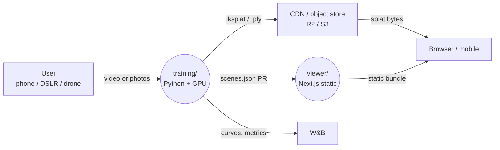
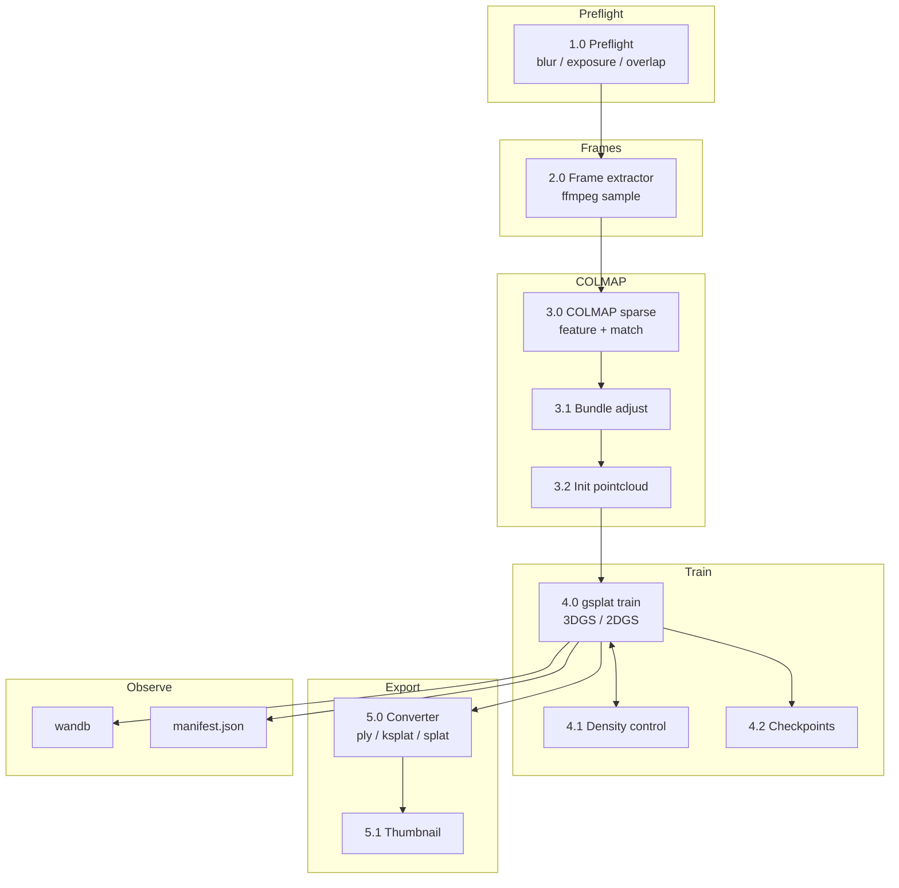
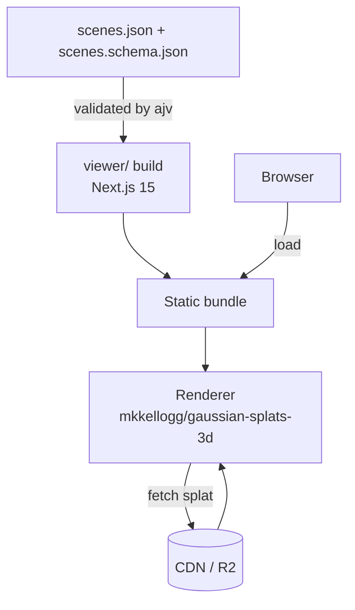
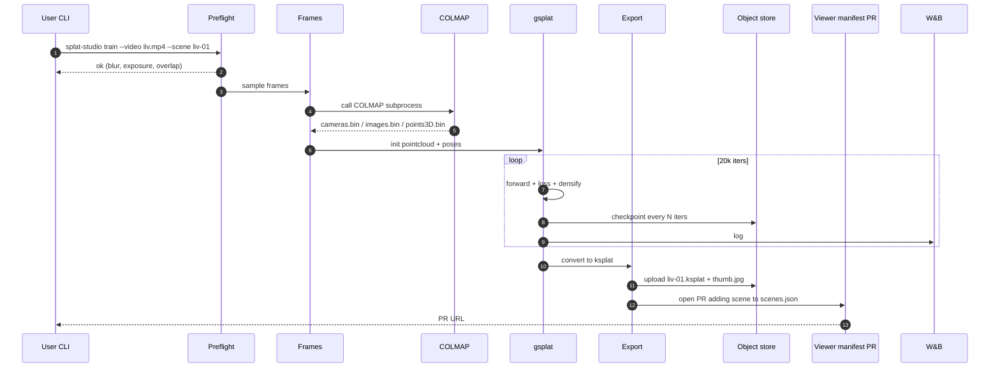
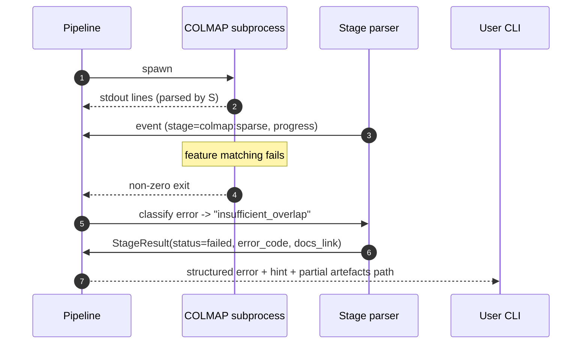
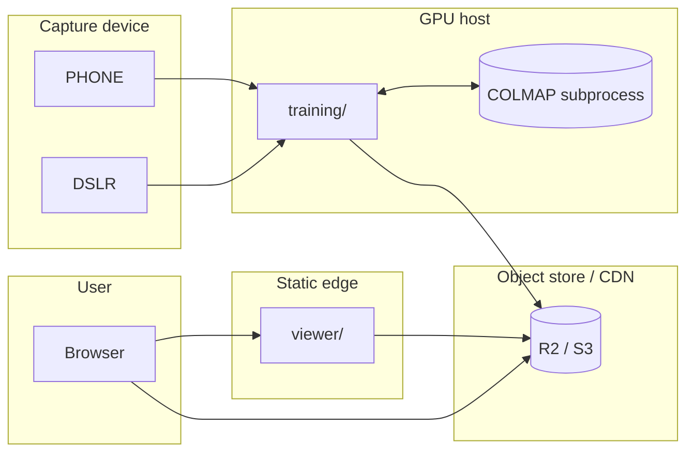

# DFD — splat-studio

## Level 0 — Context

## Level 1 — Training pipeline

## Level 1 — Viewer

## Level 2 — Phone clip → viewer URL (happy path)

## Level 2 — COLMAP failure path

## Data stores

| Store | Purpose | Retention |
|-------|---------|-----------|
| `training/runs/{scene}/` | Per-scene artefacts, manifest, checkpoints | Until manually purged |
| `wandb` | Training curves, videos | Managed |
| Object store `scenes/*.ksplat` | Scene splats | User-controlled |
| `viewer/src/components/scenes.json` | Scene catalog committed to repo | Git |

## Trust boundaries

## Invariants

- COLMAP is always invoked as subprocess; failures map to one of a closed set of
  error codes referenced in `CAPTURE.md`.
- Every scene in `scenes.json` MUST pass `ajv` validation at build time.
- Training checkpoints every N iters allow `--resume` without re-running COLMAP.
- Scene URLs in the manifest must use HTTPS (CI check).
- License field per scene in the manifest is mandatory (CC-BY, CC0, proprietary).
